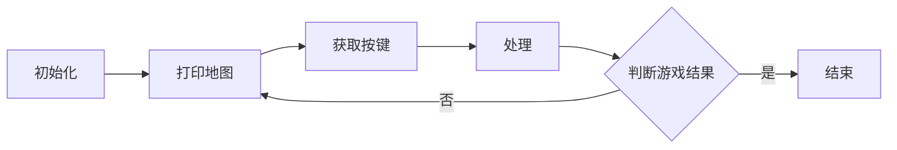

# 贪吃蛇

基于C++11和系统API的贪吃蛇，基于控制台，

### 运行示例

点击release包可以下载程序，这里给出shell运行结果。

```shell

```


### 流程图


```mermaid
flowchart LR
	初始化 --> 打印地图 --> 获取按键 --> 处理 --> A{判断游戏结果}
	A --> |是| 结束
	A -->|否| 打印地图
```


### 关键算法

如何更新贪吃蛇的位置


### 许可证

没有许可证，默认是不能随便分发的。