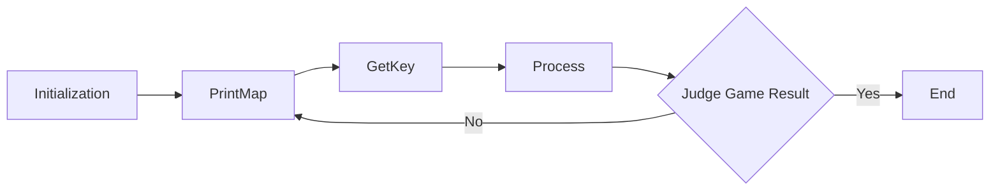
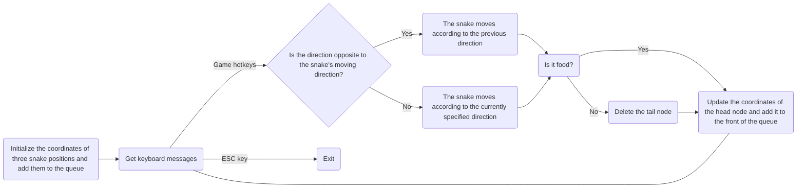

# Snake Game [中文文档点这里](README_ZH.md)

The snake game is based on C++11 and system APIs, and it runs on the console.

There are two unresolved issues in this project:

1. Food may be generated on the snake's body.
2. The moving speed is inconsistent when moving up and down due to characters.

### Running Example

You can download the program by clicking on the release package. Here is the result of running it in the shell.

```shell
$ g++.\Snake.cpp -o Snake
$.\Snake.exe
00000000000000000000000000000000000
0                                 0
0                                 0
0                                 0
0                                 0
0   Y                             0
0                                 0
0                                 0
0                                 0
0                                 0
0                                 0
0         D                       0
0         D                       0
0         D                       0
00000000000000000000000000000000000


Game over! You get 0 scores.
```

### Flow Chart



### Key Algorithms

Regarding how to update the position of the snake, a bidirectional queue in the C++ Standard Template Library (STL) is used to update the snake's position.



### License

Since there is no license, it cannot be distributed casually by default. 