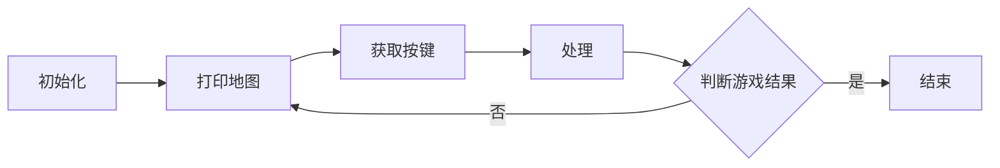
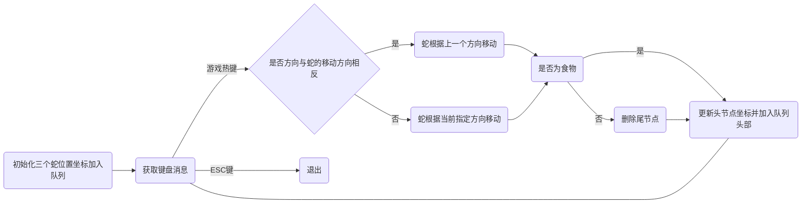

# 贪吃蛇

基于C++11和系统API的贪吃蛇，基于控制台。

这个项目有两个问题尚未解决

1. 食物生成在蛇身上
2. 因为字符导致上下的移动速度不一致

### 运行示例

点击release包可以下载程序，这里给出shell运行结果。

```shell
$ g++ .\Snake.cpp -o Snake
$ .\Snake.exe
00000000000000000000000000000000000
0                                 0
0                                 0
0                                 0
0                                 0
0   Y                             0
0                                 0
0                                 0
0                                 0
0                                 0
0                                 0
0         D                       0
0         D                       0
0         D                       0
00000000000000000000000000000000000


Game over! You get 0 scores.
```


### 流程图




### 关键算法

如何更新贪吃蛇的位置，这里使用的是C++的STL中的双向队列来更新蛇的位置




### 许可证

没有许可证，默认是不能随便分发的。